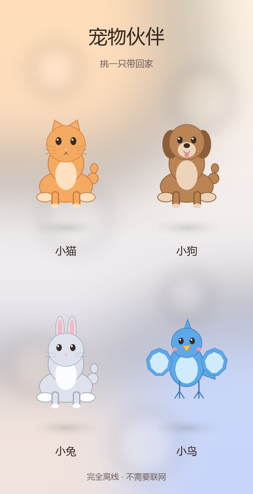
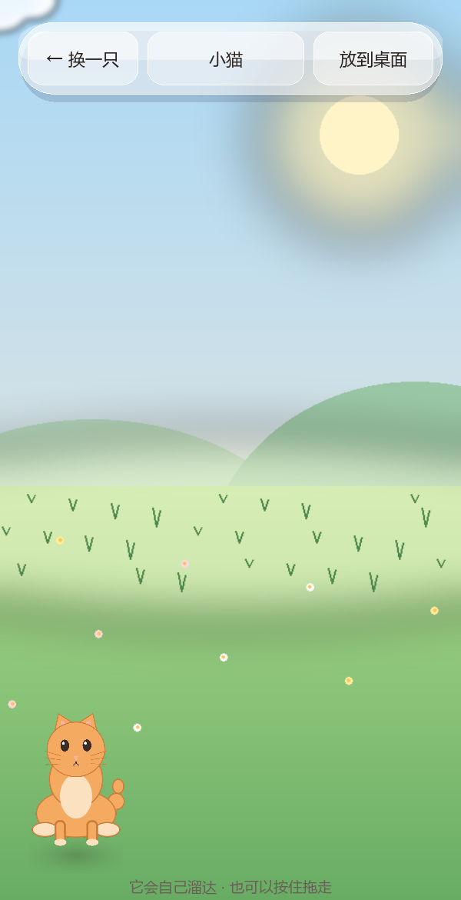

# 宠物伙伴 PetPals

Python + Kivy 写的**安卓离线**应用，一步一步来。当前完成到第 4 步。

## 现在做到哪一步

| 步骤 | 内容 | 状态 |
| --- | --- | --- |
| 1 | 空壳：能在手机上跑起来的骨架 + 打包配置 | ✅ |
| 2 | 主菜单 + 4 只预设宠物，点谁选谁 | ✅ |
| 3 | 桌宠小天地：自己溜达 + 手指拖拽 + UI 改版 | ✅ |
| 4 | 悬浮桌宠：宠物盖在系统桌面上（其他 App 上层），可以拖着走 | ✅ 代码完成，⚠️ 未真机验证 |
| 5 | 性能优化：帧率上限、纹理显存、延迟加载、启动图、体检脚本 + 预算回归 | ✅ |
| 6 | 玻璃质感 UI + 宠物有身子、四肢会动 | ✅ |
| 7 | **按物种重画：猫狗兔是坐姿四足、小鸟是翅膀+小爪子；宠物背后不再有白色底板** | ✅ 当前 |
| 8 | 真正的玩法（捕捉、互动、状态、存档、音效） | ⬜ 等你下命令 |

## 需求对照表（你提过的要求 vs 现在真实状态）

| 你提的要求 | 状态 | 说明 |
| --- | --- | --- |
| 用 Python 写、能在安卓手机上跑 | 🟡 一半 | 代码是 Python + Kivy，打包配置齐全；但**一次都没打包过、没在真机跑过**（本机是 Windows，没有 WSL/Linux） |
| 手机端不卡 | 🟡 未证 | 桌面实测：构建 16ms、每帧 0.0023ms、菜单 41FPS / 小天地 80FPS；真机数字未知。已做 5 项优化，并留下可复现的体检脚本 |
| 一个"捉宠"App | 🔴 核心没做 | 现在只有"选宠物 + 桌宠"，**"捉"这个核心玩法还没开始** |
| 先创建主菜单 | ✅ | 20 个控件的菜单，桌面自检通过 |
| 预设小猫小狗等，让用户选 | ✅ | 4 只（小猫 / 小狗 / 小兔 / 小鸟），点击选择 |
| 放"已经抠好图的 GUI" | 🟡 占位 | 素材是我用代码生成的占位图（透明背景、风格统一、**按物种画的坐姿/鸟形**）；你有正式图就直接覆盖同名文件，代码一行不用改 |
| 整个是离线 App | ✅ | 零网络代码，自检逐行扫描（连调试日志都写 logcat、不写文件） |
| 不写脚本和后门 | ✅ | 同一套扫描；悬浮窗权限是系统里**用户可见、可随时撤销**的权限，不是后门 |
| 选完宠物后"桌面"出现一个 | 🟡 分两种 | 应用内小天地：已真验证 ✅；盖在系统桌面上：代码写完但**没真机验证** |
| 让它自由活动 | ✅ | 随机换向 / 停顿 / 撞墙掉头，有单元测试 |
| 用户能移动它 | ✅ | 应用内拖拽已真验证；悬浮窗拖拽代码完成、未真机验证 |
| 不要给宠物垫白色底板 | ✅ | 菜单卡片改成完全透明，宠物直接站在背景上，脚下只有一片软阴影；按下时才浮出一层淡高光 |
| 动物不能像人一样站着 | ✅ | 猫/狗/兔改成**坐姿四足**（前爪撑地、后脚在两侧、尾巴从右侧露一截），**没有像人的手臂**；自检会断言"四足只有两条前爪、没有翅膀" |
| 小鸟要翅膀 + 小爪子，不是人腿 | ✅ | 小鸟 = 蛋形身子 + 一对翅膀 + 两条细腿三个脚趾的小爪子；自检会断言"小鸟有 2 翅膀 2 爪子、没有 paw" |
| 后续还要加功能 | ✅ 已铺路 | 纹理 / 控件数 / 每帧耗时都有预算回归测试，另有体检脚本可复现 |

图例：✅ 已验证 ｜ 🟡 部分验证或未验证 ｜ 🔴 还没做

预览（真跑起来截的图）：

| 主菜单 | 桌宠小天地 |
| --- | --- |
|  |  |

## 第 6 步：玻璃 UI 与"有身子会动"的宠物

### 玻璃面板怎么做的

每个面板（卡片 / 按钮 / 药丸 / 顶部工具栏）都画四层，全在 GPU 上画、不占纹理显存：

| 层 | 作用 |
| --- | --- |
| 向下偏移的深色圆角矩形 | 投影，让面板有"浮起来"的厚度 |
| 半透明白色圆角矩形（55%） | 玻璃主体，背后的颜色会透上来 |
| 上半部分更亮的圆角矩形 | 顶部高光 —— 这一层是"像玻璃"的关键 |
| 1px 圆角描边 | 亮边，勾出玻璃的边缘 |

菜单背景里还特意加了几颗柔光圆斑（`tools/make_ui_assets.py`）：面板是半透明的，
背后有层次才看得出是玻璃。

### 关于"真正的背景模糊"（请看一眼）

iOS / Windows 那种液态玻璃，核心是 **backdrop blur**（把身后的内容真的模糊掉）。
Kivy 里只有两条路：**stencil 裁剪 + 预先模糊的图**，或者**自定义 shader**。我没做，理由：

1. 我们的背景是柔和渐变（菜单）和低对比场景（小天地），**模糊前后肉眼几乎没差别**；
2. stencil 在部分安卓 GL 驱动上有兼容坑，而我**没有真机能验证**；
3. 为一个看不出来的效果去承担"某些手机花屏"的风险，不划算。

所以现在是"半透明 + 顶部高光 + 亮边"的**仿玻璃**，观感接近、零兼容风险。
哪天真要上真模糊（比如背景换成高清照片），单独开一步做 shader，我会先在本机验证再上。

### 宠物为什么有身子了、四肢为什么会动

素材按**物种骨架**分成几张小图（位置写在 `app/pet_layout.py`，生成脚本和界面共用）：

```
四足（猫/狗/兔）  <id>.png 头   <id>_body.png 坐姿身子   <id>_paw.png 前爪
小鸟             <id>.png 头   <id>_body.png 蛋形身子   <id>_wing.png 翅膀   <id>_claw.png 小爪子
所有宠物          <id>_full.png 全身静态图（384，菜单卡片 + 安卓悬浮窗直接用）
```

界面里由 `app/ui/pet_view.py` 的 `PetView` 按骨架拼装，关键设计：

- **所有部件画在同一个 canvas 里**（不是一堆 widget）→ 控件数量不变，布局开销为零；
- 前爪/小爪子交替迈步、翅膀扇动、头轻轻歪，都是绕各自"根部"旋转（`Rotate` + `PushMatrix`）；
- 姿态用 `dt` 缓动（`EASE_RATE`），所以"走动 ↔ 停下 ↔ 被拎起来"之间是平滑过渡，不会闪；
- 走动时整只往上**蹦**一下，脚下影子留在地上并缩小一点（坐着的小动物就是蹦着走的）；
- 站住不动时有轻微的"呼吸"晃动；被拎起来时四肢松垂、影子变淡。

### 关于"不要白色底板"和"动物不能像人一样站着"

这两条是用户明确提的，都已经落到**自检里**，改坏了会直接测试失败：

- 菜单卡片改成**完全透明**（`PetCard` 的 `tint=(1,1,1,0.0)`），宠物直接站在背景上，
  脚下只有一片软阴影（`shadow.png`，和场景共用同一张纹理，不额外占显存）；
  按下时才浮出一层很淡的高光作为反馈。想改回白卡片：把 `GLASS_TINT` 的 alpha 调回 0.5 左右，
  并把 `PetCard` 的 `shadow=False, sheen=False, edge=False` 改回默认。
- **四足只有两条前爪**（`paw_left`/`paw_right`），没有像人一样长在两侧的手臂；
  **小鸟有一对翅膀 + 两只小爪子**（`wing_*` / `claw_*`），没有 paw。
  `tests/smoke_test.py` 的"拼装位置合法且手脚贴身"会断言这两条。

拼装位置改完记得重新生成素材：`python tools/make_pet_placeholders.py`。

## 第 4 步：悬浮桌宠（系统级）

### 怎么用

1. 应用里选一只宠物（进小天地）；
2. 点右上角 **「放到桌面」**；
3. 第一次会跳到系统设置，打开 **「显示在其他应用上层」**；
4. 回到应用再点一次 —— 宠物就出现在系统桌面上了，**在其他 App 上面也能看到、能拖**；
5. 再点一次 **「召回」** 让它回来。

### 原理

```
应用（Kivy）                     后台服务（service.py，独立进程）
  app/android_bridge.py   ──start──▶  p4a 生成的 ServicePetservice
    查权限 / 跳设置页                  PythonService.mService
    拼 JSON 参数                       └─ WindowManager.addView(
                                          TYPE_APPLICATION_OVERLAY 的 ImageView)
                                       └─ OnTouchListener(拖动) → updateViewLayout
                                       └─ 位置边界由 app/overlay.py 算
```

- 服务的启动方式是 p4a 官方的 `ServicePetservice.start(activity, arg)`，参数用 JSON 传
  （服务进程里从 `PYTHON_SERVICE_ARGUMENT` 读到），里面带宠物图的**绝对路径**；
- 悬浮窗类型在 API 26+ 用 `TYPE_APPLICATION_OVERLAY`，更老的用 `TYPE_PHONE`；
- 位置计算（尺寸、默认位置、夹回屏幕内、拖动跟手）全在 `app/overlay.py`，是纯 Python，
  所以能在电脑上直接测；
- 出错只写 logcat（TAG `PetPalsOverlay`），**不写文件、不联网**。

### 申请的权限（只有这三个）

| 权限 | 为什么 |
| --- | --- |
| `SYSTEM_ALERT_WINDOW` | 显示在其他应用上层。**特殊权限**，只能在系统设置里手动开 |
| `FOREGROUND_SERVICE` | 前台服务，宠物才不会被系统随手回收 |
| `POST_NOTIFICATIONS` | 安卓 13+ 显示前台服务那条常驻通知 |

> 应用仍然**完全离线**（没有任何网络调用），但确实从"零权限"变成了这三个权限 ——
> 这是系统级悬浮桌宠的硬性要求，绕不过去。

## ⚠️ 第 4 步的验证状态（请先看这段）

**已经在电脑上验证过的：**

- `buildozer.spec` 用 **buildozer 1.6.0 自己的解析器**（`SpecParser`）读过，
  `services = ['Petservice:service.py:foreground']`、权限列表、api 均按预期解析；
- 键名 `services`（在 `[app]` 段，不是老教程里的 `android.services`）是查
  buildozer 的 `default.spec` 和 `targets/android.py` 源码确认的
  （它执行的是 `config.getlist('app', 'services')`）；
- 服务类名 `com.example.petpals.ServicePetservice` 是按 p4a 的 `Service.tmpl.java`
  里 `Service{{ name|capitalize }}` 推出来的，并且有自检**从 buildozer.spec 反推比对**；
- 前台服务的通知由 p4a 的 `PythonService.doStartForeground` 负责（自己建通知渠道），
  所以 `service.py` 里**故意不再调 `startForeground`**，免得出现两条通知；
- 悬浮窗几何（尺寸 / 默认位置 / 夹回屏幕 / 拖动跟手）有单元测试；
- "桌面上所有接口都是安全空实现"有测试（应用在电脑上照常跑）；
- 小天地里那个按钮的三段逻辑（要权限 → 启动 → 召回）有测试（用假桥模拟安卓）。

**没有验证过的（重要）：**

- ❌ **APK 一次都没打包过**（这台机器是 Windows，没有 WSL/Linux）；
- ❌ 服务能不能真的起来、悬浮窗能不能真的显示、能不能真的拖动；
- ❌ 权限申请流程在真机上的表现（不同厂商 ROM 的设置页入口不一样）；
- ❌ Android 14+ 需要给前台服务声明 `foregroundServiceType`（所以 `android.api` 暂时用 33）。

**第一件事应该是打包装到手机上试**，步骤见下面"打包"和"真机验证"。

## 目录结构

```
APP111/
├── main.py                       # 应用入口（桌面 / 安卓共用）
├── service.py                    # ★ 悬浮桌宠后台服务（只在安卓上运行）
├── app/
│   ├── config.py                 # 应用名、版本、包名、窗口尺寸、地平线比例
│   ├── resources.py              # assets 路径解析
│   ├── catalog.py                # ★ 预设宠物名录（加宠物改这里）
│   ├── roaming.py                # ★ 小天地里的自主活动逻辑（纯 Python）
│   ├── overlay.py                # ★ 悬浮窗几何计算（纯 Python）
│   ├── perf.py                   # ★ 帧率上限（静止 30 / 动画 60）
│   ├── pet_layout.py             # ★ 头/身子/四肢的拼装位置（生成脚本与界面共用）
│   ├── android_bridge.py         # ★ 权限 + 启停悬浮服务的桥（桌面是空实现）
│   ├── fonts.py                  # 中文字体查找与注册
│   ├── i18n.py                   # 界面文案（没中文字体时自动转英文）
│   ├── theme.py                  # 配色、间距、圆角、尺寸（换风格改这里）
│   └── ui/
│       ├── app.py                # App + ScreenManager + 返回键处理
│       ├── menu.py               # 主菜单
│       ├── playground.py         # 桌宠小天地：活动 + 拖拽 + 放到桌面
│       ├── pet_view.py           # ★ 会动的宠物：头 + 身子 + 四肢（同一个 canvas）
│       └── widgets.py            # 玻璃面板 / 点击容器 / 宠物卡片 / 按钮
├── assets/
│   ├── pets/<id>.png             # 头（抠图，透明背景）
│   ├── pets/<id>_body.png        # 身子（四足=坐姿，小鸟=蛋形）
│   ├── pets/<id>_paw.png         # 四足的前爪
│   ├── pets/<id>_wing.png        # 小鸟的翅膀
│   ├── pets/<id>_claw.png        # 小鸟的小爪子
│   ├── pets/<id>_full.png        # 全身静态图（菜单卡片 / 悬浮窗）
│   ├── ui/{bg_menu,bg_scene,shadow}.png # 菜单背景（半分辨率）/ 场景 / 影子
│   ├── icon.png                  # 应用图标
│   ├── presplash.png             # 开机启动图（挡住冷启动黑屏）
│   └── fonts/                    # 放中文字体（见下）
├── tools/
│   ├── make_pet_placeholders.py  # 生成占位宠物抠图和图标
│   ├── make_ui_assets.py         # 生成菜单背景 / 场景 / 影子 / 启动图
│   ├── capture_preview.py        # 跑起来截图
│   └── profile_app.py            # ★ 性能体检：启动耗时 / 显存 / 帧率 / 掉帧
├── tests/
│   ├── smoke_test.py             # 离线自检（不需要 Kivy）
│   └── kivy_headless_check.py    # 界面自检（需要 Kivy）
├── docs/                         # 预览截图
├── .github/workflows/android.yml # 云端打 APK（GitHub Actions）
├── BUILD.md                      # ★ 三条出包路线 + 装机后怎么试
├── buildozer.spec                # 安卓打包配置（权限 / 服务 / API）
├── requirements.txt              # 桌面运行依赖
└── requirements-build.txt        # 打包机依赖（Linux/WSL/macOS）
```

## 一、在电脑上先看效果

```bash
python -m pip install -r requirements.txt
python main.py
```

电脑上点「放到桌面」会提示"只在安卓手机上可用"（`service.py` 和 jnius 都只在安卓生效）。
想直接出截图（会真弹一下窗口，约 1 秒后自动退出）：

```bash
python tools/capture_preview.py                                       # 主菜单
python tools/capture_preview.py --pet cat --out docs/play.png         # 带小猫进小天地
```

## 二、打包成 Android APK

Buildozer 只能在 **Linux / WSL2 / macOS** 上跑（Windows 需要 WSL）。
**这台开发机打不出 APK**（没有 WSL/Docker/JDK/SDK），三条出包路线写在 **[BUILD.md](BUILD.md)**：
GitHub Actions 云端打包（推荐，不用装 Linux）、本机装 WSL、Pydroid 直接跑源码。

```bash
python -m pip install -r requirements-build.txt
buildozer -v android debug
# 产物：bin/petpals-0.7.0-debug.apk
```

## 三、真机验证悬浮桌宠（下一步该做的）

```bash
adb install -r bin/petpals-0.7.0-debug.apk
adb logcat -s PetPalsOverlay python        # 另开一个窗口看日志
```

然后在手机上：**选宠物 → 点「放到桌面」→ 允许「显示在其他应用上层」→ 回来再点一次**。

日志里应该看到：

```
桌宠已上桌面: 302x302px @ (x, y)，屏幕 1080x2400
```

出问题时日志会说得很具体，对着看就行：

| 日志 | 意思 |
| --- | --- |
| `找不到宠物图片: '...'` | 参数没传到，或应用目录路径不对 |
| `宠物图解码失败` | 路径对了但 png 读不了 |
| `加悬浮窗失败（多半是没给「显示在其他应用上层」权限）` | 权限没开 |
| 完全没有日志 | 服务根本没起来 —— 先确认 `buildozer.spec` 里 `services` 那一行没被改坏 |

## 四、不打包，直接在手机上跑（没有悬浮桌宠）

- **Pydroid 3**：整个项目目录拷到手机，用它的 pip 装 `kivy`，打开 `main.py` 运行。
- **Termux**：装好 python 和 kivy 后，在项目目录执行 `python main.py`。

这两种方式跑的是应用内的小天地，不能用悬浮窗（没有 p4a 的服务和权限声明）。

## 五、中文字体（重要）

Kivy 自带字体**没有中文字形**，缺字体时界面会变成方框。处理方式：

1. 把可再分发的字体（如 Noto Sans SC / 思源黑体，OFL 协议）放进 `assets/fonts/`，
   会自动注册并一起打进 APK —— **推荐**；
2. 没放字体时，桌面调试会用系统自带中文字体（仅本机使用、不打包）；
3. 都没有时，界面文案自动切成英文（不会出现方框）。

注意：**悬浮窗上的宠物是原图，不受字体影响**；前台服务那条通知是安卓系统画的，
也用系统字体，中文一直正常。

## 六、加一只新宠物（3 步）

1. 把抠好的透明背景 PNG 放进 `assets/pets/`，正方形，建议 512×512；
2. 在 `app/catalog.py` 的 `PETS` 里加一条（id / 中英文名 / 图片路径 / 卡片主色）；
3. `python tests/smoke_test.py`。

## 七、调参数

| 想改什么 | 改哪里 |
| --- | --- |
| 小天地里走多快 / 停多久 | `app/roaming.py` 的 `SPEED`、`WALK_*`、`PAUSE_*` |
| 四肢摆多大幅度 | `app/ui/pet_view.py` 的 `PAW_SWING`、`CLAW_SWING`、`WING_SWING`、`IDLE_*` |
| 动作过渡的软硬 | 同文件 `EASE_RATE`（越小越"软"） |
| 手脚摆动频率 / 蹦多高 | `app/ui/playground.py` 的 `WALK_RATE`、`app/theme.py` 的 `PET_HOP` |
| 宠物各部件的位置/大小、物种骨架 | `app/pet_layout.py`（改完重新生成素材：`python tools/make_pet_placeholders.py`） |
| 玻璃的透明度 / 高光 / 亮边 | `app/theme.py` 的 `GLASS_*` |
| 悬浮窗多大 | `app/overlay.py` 的 `DEFAULT_SIZE_RATIO` |
| 悬浮窗默认位置 | 同文件 `DEFAULT_HEIGHT_RATIO`、`MARGIN_RATIO` |
| 宠物大小（小天地里） | `app/theme.py` 的 `PET_SIZE` |
| 活动范围 / 地平线 | `app/config.py` 的 `SCENE_HORIZON` |
| 通知文案 | `app/android_bridge.py` 的 `NOTIFICATION_TITLE/TEXT` |
| 服务名字 | `buildozer.spec` 的 `services` + `app/android_bridge.py` 的 `SERVICE_CLASS`（自检会比对） |

想让它**关掉应用后也活着**：把 `services` 改成
`Petservice:service.py:foreground:sticky`。**但目前不建议**——系统重启粘性服务时
拿不到图片参数，宠物会静默消失；要做就得先把"上次用的宠物"持久化下来。

## 八、自检

```bash
python tests/smoke_test.py          # 不装 Kivy 也能跑：素材、活动逻辑、悬浮窗几何、配置、零联网
python tests/kivy_headless_check.py # 需要 Kivy：真把界面建出来，验证选宠 / 活动 / 拖拽 / 返回键 / 放到桌面按钮
```

`kivy_headless_check.py` 会开一个隐藏窗口（Windows 上不要设 `SDL_VIDEODRIVER=dummy`，
会让 Kivy 直接崩溃）；没有显示器的环境可以 `PETPALS_MOCK_GL=1`。

## 九、离线与"无后门"的自证

- 依然**没有任何网络代码**：自检会扫描 `main.py`、`service.py`、`app/`、`tools/` 的每一行，
  出现 `socket / urllib / requests / http / subprocess / ctypes / pickle / base64 /
  os.system / eval / exec / compile / __import__ / open(` 或 `http://`、`https://` 就直接失败
  （所以 `service.py` 连调试日志都是写 logcat，不写文件）；
- 权限**只有悬浮桌宠必需的三个**，自检会断言这个集合完全相等——多一个（相机、定位、存储…）都会失败；
- 说明：桌面 `pip install kivy` 会顺带装上 `requests`（Kivy-Garden 的依赖），
  我们的代码从不 import 它；安卓端只按 `buildozer.spec` 的 `requirements` 装 `python3` 和 `kivy`。

## 十、性能：做了什么、实测多少、怎么复现

> 下面全是**桌面**数字（NVIDIA 独显 + 无 vsync 锁），**不等于手机**。
> 但优化前后的对比是同一台机器、同一套脚本跑出来的，趋势可信。

复现命令（加 `--seconds 4` 会真跑 4 秒主循环量帧率，窗口会短暂出现）：

```bash
python tools/profile_app.py --seconds 4
```

### 优化前 -> 优化后 -> 现在

| 指标 | 优化前 | 第 5 步后 | 现在（第 7 步） | 说明 |
| --- | --- | --- | --- | --- |
| 界面构建（主菜单） | 25.0 ms | 16 ms | **20 ms** | 卡片每只多了一片脚下阴影 |
| 冷启动纹理显存 | 5.95 MB | 4.49 MB | **2.86 MB** | 菜单卡片用 384² 全身图 + 共用一张 shadow.png |
| 进小天地后总显存 | 8.03 MB | 6.57 MB | **6.13 MB** | 多出宠物身子/四肢/翅膀，仍低于之前 |
| 菜单背景解码 | 5.92 ms | 1.79 ms | **1.79 ms** | 256x500 代替 512x1000 |
| 每帧推进 | 0.0024 ms | 0.0023 ms | **0.024 ms** | 宠物多部件后仍只占 16.7ms 预算的 0.14% |
| 主菜单帧率 | 82 FPS | 41 FPS | **40 FPS** | 静止页面限 30 帧，省一半 GPU |
| 小天地帧率 | 82 FPS | 80 FPS | **79 FPS** | 有动画保留 60 帧上限 |

### 具体五项措施

1. **分页面帧率上限**（`app/perf.py`）：主菜单完全静止，限 30 帧；小天地有动画/拖拽，60 帧。
   实测帧间隔正好翻倍（24.5ms vs 12.2ms）——**等于省一半 GPU 和电**。
   关键实现点：Kivy 的 Clock 是**每次 tick** 读 `self._max_fps`（`kivy/clock.py` 里多处
   `fps = self._max_fps`），所以运行时改它当场生效，不用重启应用。
2. **场景/影子延迟加载**：这两张图（2MB 显存 + 6ms 解码）改成第一次进小天地才加载，
   冷启动不用等它们。
3. **菜单背景半分辨率**：整张图就是柔和渐变，256x500 放大后肉眼看不出区别，
   显存变 1/4、解码快 3 倍。
4. **启动图（presplash）**：安卓在 Python 起来之前先显示 `assets/presplash.png`，
   挡住冷启动那 300-400ms 的黑屏（观感上的"打开更快"）。
5. **纹理预算回归测试**：自检会断言冷启动纹理 ≤ 5MB、两页合计 ≤ 7.5MB、
   单页控件 ≤ 60 个、每帧推进 ≤ 2ms —— 后续加功能时一旦超标，测试直接失败。

### 后续加功能时的预算红线

| 红线 | 当前 | 上限 | 在哪检查 |
| --- | --- | --- | --- |
| 冷启动纹理显存 | 2.86 MB | 5.0 MB | `tests/kivy_headless_check.py` |
| 两页合计纹理 | 6.13 MB | 7.5 MB | 同上 |
| 单页控件数 | 28 / 13 | 60 | 同上 |
| 每帧推进 | 0.024 ms | 2 ms | 同上 |
| 界面构建 | 20 ms | 3000 ms | 同上 |

超了就改 `tests/kivy_headless_check.py` 顶部的常量**并说明理由**，
不要直接把断言删掉。

## 许可证

[MIT](LICENSE) —— 随便用、随便改、随便发，保留版权声明即可。

- 代码：本项目作者
- 依赖：[Kivy](https://kivy.org)（MIT）、[python-for-android](https://github.com/kivy/python-for-android)（MIT）
- 美术素材：`assets/` 下的图都是本项目用 `tools/` 里的脚本**代码生成**的占位图
  （透明背景），跟着 MIT 一起用没问题；你换成自己的正式美术时，注意那批图的版权。

> 不要往仓库里提交密钥（token / keystore）。打包用的签名是 buildozer 自动生成的 debug 签名，
> 发布到应用商店前要换成你自己的 release keystore，并且**不要把 keystore 提交上来**。

## 十一、还没做的功能（待办）

- **捉**：宠物随机出现、投掷/点击捕捉、成功率、捕捉动画（核心玩法，还没开始）
- **宠物状态**：饥饿 / 心情 / 亲密度、喂食、抚摸
- **存档**：记录已收集的宠物和当前位置（应用私有目录不需要权限）
- **图鉴**：收集列表和详情
- **更多姿态**：吃东西 / 睡觉 / 被抚摸 / 开心跳一下（现在只有走路、站立、被拎起三种）
- **音效 / 背景音乐**
- **多场景**：换地图、不同地点出不同宠物
- **悬浮桌宠的收尾**：手机上的实测、点击宠物的互动、关掉应用后仍然活着（要持久化参数）
- **打包验证**：APK 构建目前一次都没在真机/真打包机上跑过
